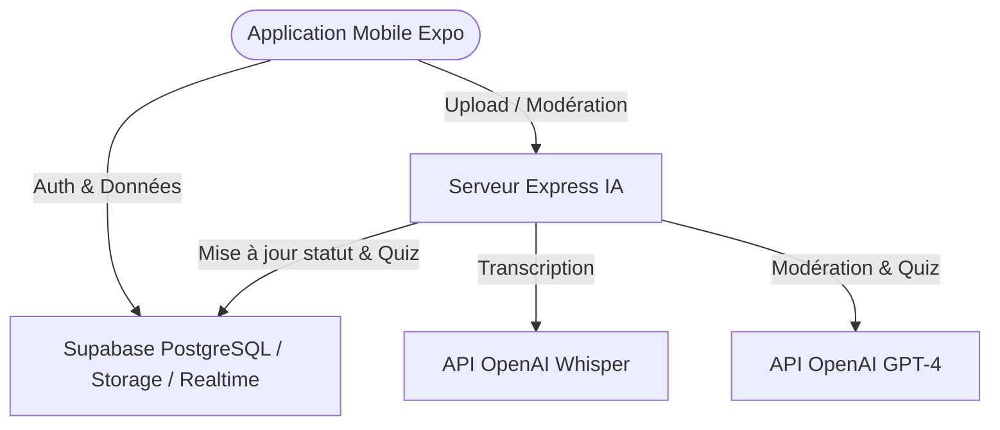

# EduSnap 🚀 — TikTok Éducatif avec Gamification & Modération IA

EduSnap est une application mobile d'apprentissage ultra-ludique, combinant le format addictif d'un flux vertical de type TikTok avec un système robuste de QCM, de gamification avancée et de modération de contenu par intelligence artificielle (Whisper + GPT-4).

---

## 🏗️ Architecture Technique Globale



---

## 🛠️ Fonctionnalités Majeures

### 📱 1. Flux Vidéo Vertical "TikTok" (`app/(tabs)/index.tsx`)
- Lecture vidéo plein écran fluide via `expo-av`.
- **Autoplay / Lazy loading** optimisé au scroll avec `FlatList` et `viewabilityConfig`.
- Barre de progression interactive, Likes réactifs, Sauvegarde et Partage natif.

### ❓ 2. Système de Quiz Interactif (`components/feed/QuizOverlay.tsx`)
- Overlay apparaissant dès la fin de lecture du cours.
- **Compte à rebours de 15 secondes** dynamique avec barre de chargement décroissante.
- Évaluation instantanée de la réponse et explication pédagogique détaillée.
- **Effets physiques** : Animation Reanimated de vibration (shake) en cas d'erreur ou d'échelle en cas de réussite.

### 🏆 3. Gamification Avancée (`stores/xpStore.ts`, `supabase_schema.sql`)
- **Calcul sécurisé de l'XP** via fonctions PL/pgSQL RPC pour éviter la triche.
- Niveaux d'apprentissage dynamiques (Novice ➔ Apprenti ➔ Scholar ➔ Expert ➔ Master).
- **Compteur de Streaks** : Suivi des jours d'activité consécutifs avec doublement d'XP et bonus exceptionnels tous les 7 jours.
- **10 Badges Thématiques** (ex: *Premier Quiz*, *Semaine de feu*, *Polyglotte*, *Historien*, *Sage d'EduSnap*) attribués automatiquement en tâche de fond par des triggers base de données SQL.

### 📚 4. Classement (Leaderboard) (`app/(tabs)/leaderboard.tsx`)
- Podium 3D stylisé pour le Top 3 avec couronnes dorées et avatars en surbrillance.
- Possibilité de filtrer le classement de manière globale ou **par matière académique** spécifique.
- Sticky footer permanent indiquant le rang en temps réel de l'utilisateur.

### 🛣️ 5. Parcours Guidés (`app/path/[id].tsx` & `app/(tabs)/explore.tsx`)
- Recherche unifiée et filtrage par matière (Mathématiques, SVT, Philosophie, Anglais...).
- Organisation des leçons en **syllabus structurés**.
- Mécanisme de déverrouillage linéaire des vidéos (les cours suivants restent bloqués tant que la leçon précédente n'est pas assimilée avec son quiz).

### 🛠️ 6. Espace Créateur & Upload (`app/creator/`)
- Tableau de bord analytique complet avec graphiques et KPIs (Vues, abonnés, XP générés).
- Formulaire d'upload multi-page.
- **Génération automatique de Quiz par l'IA** en un clic basée sur le titre et la matière de la leçon.

### 🛡️ 7. Espace Modération Administrateur (`app/admin/`)
- Validation des vidéos en attente avec score de pertinence scientifique (0-100) calculé par GPT-4.
- Gestion des signalements utilisateurs (Option Ignorer ou Bannir / Suspendre la vidéo avec notification automatique au créateur).

---

## 🔒 Schéma Base de Données & RLS (Supabase)

Toutes les tables sont sécurisées via des politiques **Row Level Security (RLS)** restrictives :
- `profiles` : Lecture publique, modification limitée au propriétaire authentifié.
- `videos` : Lecture autorisée uniquement si la vidéo est approuvée (`approved`), appartient au créateur, ou si l'utilisateur est administrateur.
- `questions` : Accessible uniquement si la vidéo parente est approuvée.
- `reports` : Signalement inséré uniquement par le plaignant, consultable par l'administrateur.

---

## 🚀 Lancement Rapide

### 🛰️ Étape 1 : Initialisation Supabase
Copiez et exécutez le contenu de `supabase_schema.sql` directement dans l'éditeur SQL de votre console Supabase pour configurer les tables, les déclencheurs automatiques de badges/likes, et les buckets de stockage.

### 💻 Étape 2 : Lancer le Serveur de Modération IA (Express)
1. Allez dans le dossier `server/` :
   ```bash
   cd server
   ```
2. Créez un fichier `.env` sur le modèle suivant :
   ```env
   PORT=3001
   OPENAI_API_KEY=votre_cle_openai
   SUPABASE_URL=votre_url_supabase
   SUPABASE_SERVICE_ROLE_KEY=votre_cle_service_role
   ```
3. Installez les paquets et démarrez le serveur :
   ```bash
   npm install
   npm run dev
   ```

### 📱 Étape 3 : Démarrer l'application Expo (React Native)
1. Installez les dépendances à la racine du projet :
   ```bash
   npm install
   ```
2. Créez un fichier `.env` à la racine :
   ```env
   EXPO_PUBLIC_SUPABASE_URL=votre_url_supabase
   EXPO_PUBLIC_SUPABASE_ANON_KEY=votre_cle_anonyme_supabase
   ```
3. Lancez Expo :
   ```bash
   npm run start
   ```
